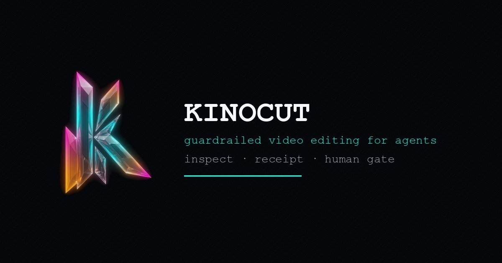

# Kinocut site

Kinocut site is the open-source static website for [Kinocut](https://github.com/KyaniteLabs/kinocut), a video editing toolkit. It contains the pages, styles, scripts, tests, and machine-readable files published at [kinocut.dev](https://kinocut.dev/).

**TL;DR:** clone from Forgejo, serve the static files, run the tests, and submit site changes to Forgejo. The Kinocut product repository owns the Python package, CLI, MCP implementation, and releases.

<!-- s-plus-geo:start -->
Kinocut site is a bilingual static documentation and product website. KyaniteLabs Forgejo is the canonical site source, GitHub is the public site mirror, GitHub hosts the canonical Kinocut product code, and kinocut.dev is the separately deployed Netlify production site.
<!-- s-plus-geo:end -->



## Status and repository authority

| Surface | Role | Authority |
| --- | --- | --- |
| [Forgejo site](https://git.kyanitelabs.tech/KyaniteLabs/kinocut-site) | Website source | Canonical; site changes land here first |
| [GitHub site](https://github.com/KyaniteLabs/kinocut-site) | Website source | Public collaboration mirror |
| [GitHub product](https://github.com/KyaniteLabs/kinocut) | Kinocut implementation | Canonical product code and releases |
| [kinocut.dev](https://kinocut.dev/) | Published website | Netlify production, deployed and verified separately |

A source merge does not prove a production deployment, and a source file does not prove that its production route is live.

## Audience

- People evaluating Kinocut can start with the [homepage](index.html), [installation guide](install.html), [tutorial](tutorial.html), and [FAQ](faq.html).
- Developers and creators can read the [integration guide](integrations.html), [prompt guide](prompts.html), and [receipt guide](receipt.html).
- Site contributors can use the source map, local server, tests, and design contract below.
- Deployment operators can validate source before an owner-approved Netlify deployment and live check.

## Source map and what you can inspect

The site has no application build step. Its pages and assets are committed directly.

| Path | Purpose |
| --- | --- |
| [`index.html`](index.html) | English homepage and primary surface |
| [`es.html`](es.html), [`es-content.html`](es-content.html) | Spanish pages |
| [`install.html`](install.html), [`tutorial.html`](tutorial.html), [`faq.html`](faq.html) | Core documentation |
| [`contribute.html`](contribute.html) | Contribution guidance |
| [`css/`](css/) | Design tokens, homepage styles, and documentation styles |
| [`js/site.js`](js/site.js) | Shared browser behavior |
| [`tests/`](tests/) | Public-claim and agent-discovery tests |
| [`llms.txt`](llms.txt) | Plain-text guide to public resources |
| [`openapi.json`](openapi.json) | Machine-readable agent-surface description |
| [`docs/agent-api.md`](docs/agent-api.md) | Human-readable agent-surface documentation |
| [`netlify.toml`](netlify.toml) | Netlify routing and edge-function configuration |
| [`netlify/edge-functions/agent-discovery.js`](netlify/edge-functions/agent-discovery.js) | Agent-discovery edge-function source |

Unlike this static site, product implementation and releases live in the [Kinocut product repository](https://github.com/KyaniteLabs/kinocut).

## Run locally

```bash
git clone https://git.kyanitelabs.tech/KyaniteLabs/kinocut-site.git
cd kinocut-site
python3 -m http.server 8000
```

Open <http://localhost:8000/>. The local server previews static assets; it does not reproduce Netlify edge behavior or prove a production deployment.

## Validate a change

`npm test` requires Node.js, npm, and global Web Crypto (`crypto.randomUUID`). The suite was tested with Node.js v26.7.0; this repository does not declare a fixed Node version.

```bash
npm test
./scripts/verify-primary-surface.sh
```

`npm test` checks public claims and agent-discovery behavior. `verify-primary-surface.sh` checks the local homepage and design markers. Visual changes still need rendered browser review. Production behavior must be checked after deployment.

After a README change, confirm that the canonical Forgejo README and GitHub mirror match. Keep repository tests, browser review, and production verification as separate checks.

## Machine-readable surfaces

[`llms.txt`](llms.txt), [`openapi.json`](openapi.json), [`docs/agent-api.md`](docs/agent-api.md), and the [edge-function source](netlify/edge-functions/agent-discovery.js) document the intended discovery surfaces. Confirm production URLs directly when work depends on deployed routing, headers, or responses.

## Community and contributions

Read [`AGENTS.md`](AGENTS.md) for repository rules and [`DESIGN-SYSTEM.md`](DESIGN-SYSTEM.md) for the visual contract. Review [`tests/`](tests/) before changing public claims or discovery behavior. Product contributions belong in the [Kinocut product repository](https://github.com/KyaniteLabs/kinocut).

Site changes follow a Forgejo-first workflow: branch from the current Forgejo tip, keep the patch focused, run the local checks, and submit the change there. GitHub mirrors the site repository.

Netlify deployment is owner-controlled and separate from merging source. When a deployment is approved, the repository command is:

```bash
npx netlify deploy --prod --dir .
```

Verify the live homepage and changed claims after deployment.

## FAQ

### Is this the Kinocut product repository?

No. This is the static website repository. The [product repository](https://github.com/KyaniteLabs/kinocut) contains the package, CLI, MCP server, and release history.

### Which repository is authoritative for the site?

The [Forgejo site repository](https://git.kyanitelabs.tech/KyaniteLabs/kinocut-site) is canonical. The GitHub site repository is its public collaboration mirror.

### Does a site merge deploy kinocut.dev?

No. A merge establishes site source history. Netlify deployment and live verification are separate.

### How should release claims be verified?

Check versions and implementation claims against the canonical product repository and published artifacts. Then verify the intended claim in site source and on the live page.

## License

This site is licensed under Apache-2.0. See [`LICENSE`](LICENSE).
